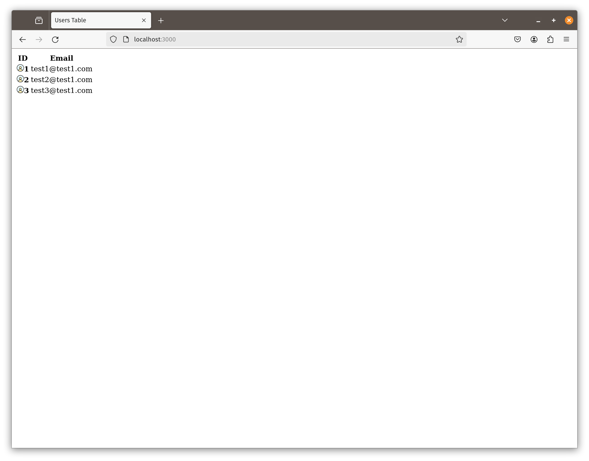

# Assets and Cache Busting

We'll want to add assets to our project such as images, css and perhaps javascript (but hopefully not javascript).

Cache busting is where we invalidate a cached file and force the browser to retrieve the file from the server. We can instruct the browser to bypass the cache by simply changing the filename. To the browser, this is a completely new resource so it will fetch the resource from the server. The most common way to do this is to add the hash of the file to the URL.

We can also generate some code so the assets are available in our Rust pages and then we get the added benefit that if the files are deleted or names are changed we get compiler errors.

## Create an Asset Pipeline

```sh
cargo init --lib crates/web-assets
```

## Add an image

Add the following to `crates/web-assets/images/favicon.svg`

```svg
<svg xmlns="http://www.w3.org/2000/svg" viewBox="0 0 256 256">
    <rect width="256" height="256" fill="none"></rect>
    <line x1="208" y1="128" x2="128" y2="208" fill="none" stroke="currentColor" stroke-linecap="round" stroke-linejoin="round" stroke-width="32"></line>
    <line x1="192" y1="40" x2="40" y2="192" fill="none" stroke="currentColor" stroke-linecap="round" stroke-linejoin="round" stroke-width="32"></line>
</svg>
```

## Using Cache Busters

We'll use [Cache Busters](https://github.com/bionic-gpt/cache-busters) to generate code that allows to access assets in a typesafe way. Cache busters also handles hashing so that we never have to worry about the browser deploying the wrong CSS or Images.


Create a  `crates/web-assets/build.rs` so that the `main` method looks like the following.

```rust
use cache_busters::generate_static_files_code;
use std::env;
use std::path::PathBuf;

fn main() {
    let static_out_dir = PathBuf::from(env::var("OUT_DIR").unwrap());

    // Example of multiple asset directories
    let asset_dirs = vec![
        PathBuf::from("./images"),
    ];

    generate_static_files_code(&static_out_dir, &asset_dirs).unwrap();
}
```

Setup our dependencies

```sh
cd crates/web-assets
cargo add mime@0.3
cargo add --build cache-busters@0.1
```

`build.rs` will now take our assets and turn them into rust functions. It handles creating a hash for the assets so we get good browser cache busting.

## Export the Assets

We needs to export our assets from our crate overwrite the `crates/web-assets/src/lib.rs`

```rust
include!(concat!(env!("OUT_DIR"), "/static_files.rs"));
pub use statics as files;
```

## Configuring a route for our assets

Back to our `web-server` crate.

create a new file `crates/web-server/src/static_files.rs` and add the following function.

```rust
use axum::body::Body;
use axum::http::{header, HeaderValue, Response, StatusCode};
use axum::response::IntoResponse;
use axum_extra::routing::TypedPath;
use serde::Deserialize;
use tokio_util::io::ReaderStream;
use web_assets::files::StaticFile;

#[derive(TypedPath, Deserialize)]
#[typed_path("/static/*path")]
pub struct StaticFilePath {
    pub path: String,
}

pub async fn static_path(StaticFilePath { path }: StaticFilePath) -> impl IntoResponse {
    let path = format!("/static/{}", path);

    let data = StaticFile::get(&path);

    if let Some(data) = data {
        let file = match tokio::fs::File::open(data.file_name).await {
            Ok(file) => file,
            Err(_) => {
                return Response::builder()
                    .status(StatusCode::NOT_FOUND)
                    .body(Body::empty())
                    .unwrap()
            }
        };

        // convert the `AsyncRead` into a `Stream`
        let stream = ReaderStream::new(file);

        return Response::builder()
            .status(StatusCode::OK)
            .header(
                header::CONTENT_TYPE,
                HeaderValue::from_str(data.mime.as_ref()).unwrap(),
            )
            .body(Body::from_stream(stream))
            .unwrap();
    }
    Response::builder()
        .status(StatusCode::NOT_FOUND)
        .body(Body::empty())
        .unwrap()
}
```

And add the following route in `crates/web-server/src/main.rs` in the section where we defined our routes.

```rust
.route("/static/*path", get(static_files::static_path))
```

And change the `mod` section so it includes the following.

```rust
mod static_files;
```

## Using our image

Let's add the image to the page.

In our `crates/web-pages` directory run...

```sh
cargo add --path ../web-assets
```

And update the `crates/web-pages/src/root.rs` so it includes our image.

```rust
use crate::{layout::Layout, render};
use db::User;
use dioxus::prelude::*;
use web_assets::files::favicon_svg;

pub fn index(users: Vec<User>) -> String {
    let page = rsx! {
        Layout {    // <-- Use our layout
            title: "Users Table",
            table {
                thead {
                    tr {
                        th { "ID" }
                        th { "Email" }
                    }
                }
                tbody {
                    for user in users {
                        tr {
                            td {
                                // 👇 We added the image
                                img {
                                    src: favicon_svg.name,
                                    width: "16",
                                    height: "16"
                                }
                                strong {
                                    "{user.id}"
                                }
                            }
                            td {
                                "{user.email}"
                            }
                        }
                    }
                }
            }
        }
    };

    render(page)
}
```

Update your just file so any changes to the `web-pages` crate are reflected in the browser.

Add this `-w crates/web-pages`.

## The Finished Result

That was a lot of work to put images on the screen but don't forget we now have a typesafe way to access images. 


